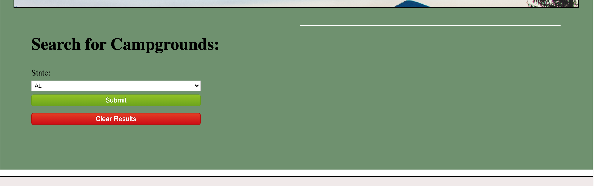

# Campgrounds Inc. 

## Overview
Campgrounds Inc. is an application that allows users to search for different national park campgrounds by state. When the user signs up for an account and is logged in, they can also save their favorite campgrounds to their dashboard. They can also create blog posts from their dashboard to share more details about their experiences at the campgrounds. This application uses the National Park Service's API: https://www.nps.gov/subjects/developer/api-documentation.htm

## Deployed Application
This appilcation is deployed using Heroku: https://agile-journey-10175.herokuapp.com/

## Screenshots

## Contributors
This application was created by [Alexsis Conley Brown](https://github.com/AlexsisMCB), [Ali Rueter](https://github.com/alirueter), [Jess Wade](https://github.com/jwade1327), and [Keegan Wedwick.](https://github.com/kwedwick)
